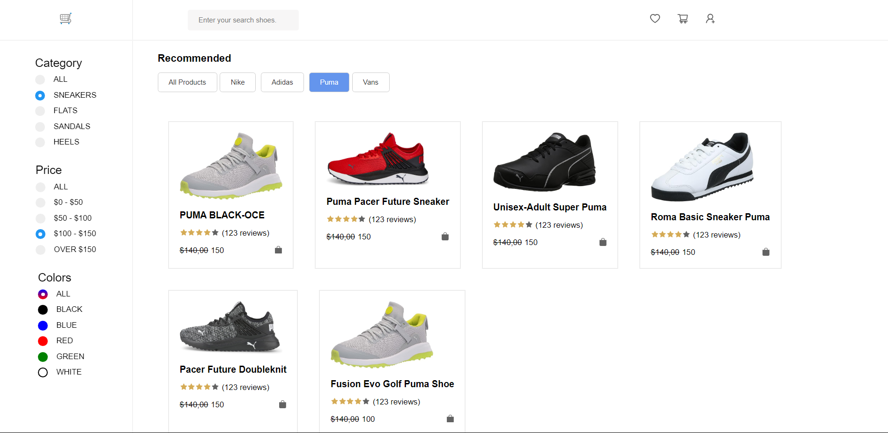

# Trend Foot 👟

> Discover the perfect pair effortlessly with Trend Foot's user-friendly filters, vibrant color choices, and top-brand selections that make shoe shopping a breeze.

</img>

## Try it Live!

Check out the live app [trend-foot](https://mahmoud-mohsen-dev.github.io/trend-foot/)

## How to Use

-   Browse a diverse collection of shoes
-   Filter by name, categories, price, colors, or brand.
-   Combine multiple filters for a personalized search.

## Features

-   Filter by categories, price, or colors
-   Search by the shoe title or name
-   Filter by different brands
-   Combine multiple filters

## Challenges

Integrating multiple filters.

**How I tackled this challenge**

1. At first each section filters their version of data. send filter data to the app component.
2. Loop over the received data to filters only that occurred on all filter sections
3. Display filtered data to the screen

## Tools Used

-   TypeScript
-   React
-   CSS
-   Vite

## Getting Started

1. Clone this repository.

    ```bash
    git clone https://github.com/mahmoud-mohsen-dev/trend-foot.git
    ```

2. Navigate to the Project Directory:
    ```bash
    cd trendfoot
    ```
3. Install Dependencies:

    ```bash
     npm install
    ```

4. Development Server

    ##### Start the Development Server:

    ```bash
    npm run dev
    ```

5. Open in your Browser:

    Open your web browser and go to http://localhost:3000 to see the app in action.

_Now you have the "trendfoot" app on your local machine._
